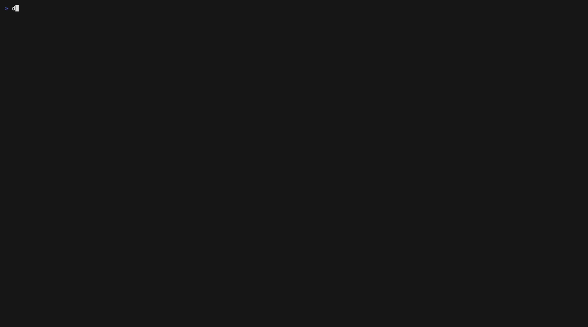

# dnsglobe

[](https://crates.io/crates/dnsglobe)
[](https://aur.archlinux.org/packages/dnsglobe/)
[](https://aur.archlinux.org/packages/dnsglobe-bin/)
[](LICENSE)

**A global DNS propagation checker for your terminal** — a Rust TUI that
queries 34 public DNS resolvers around the world in parallel, compares their
answers, and shows the propagation of your record on a world map.



Think dnschecker.org / whatsmydns.net, but in your terminal, with watch mode:
start a check and it re-polls until the record has propagated everywhere.

Resolvers span the global anycast networks (Google, Cloudflare, Quad9),
North America, Europe, Russia, the Middle East, East Asia, and the southern
hemisphere (Telstra AU, SafeSurfer NZ, UOL BR) — each queried directly, so
you see every server's own current view of the record.

Each resolver is queried directly (no cache, EDNS0, TCP fallback for
truncated answers), so what you see is each server's own current view of the
record. Answers sharing any record are grouped together — so round-robin DNS
(each resolver caching a different subset of an IP pool) counts as one
consistent answer, not twenty conflicting ones. The propagation gauge shows
how many resolvers are in the majority group; outliers are flagged
`≠ DIFFERS` once all results are in.

On terminals ≥150 columns wide, a world map appears on the right with one
dot per resolver, colored by status (green agrees, magenta differs, red
error, yellow in flight).

Anycast networks are asked which of their sites is answering you: Quad9
(`TXT id.server.on.quad9.net`), Cloudflare (`CH TXT id.server`), Google
(egress subnet via `TXT o-o.myaddr.l.google.com` matched against
`TXT locations.publicdns.goog`), OpenDNS (`TXT debug.opendns.com`),
CleanBrowsing, and Neustar UltraDNS. The discovered site shows in the Loc
column as `→YUL`-style codes, and the resolver's map dot moves to the POP
actually serving your queries.

## Usage

Install:

```sh
brew install 514-labs/tap/dnsglobe   # Homebrew (macOS/Linux)
cargo install dnsglobe               # from crates.io
yay -S dnsglobe                      # from archlinux aur (compile from source)
yay -S dnsglobe-bin                  # from archlinux aur (install prebuilt binary)
nix run github:514-labs/dnsglobe     # Nix flakes (builds from source)
# or grab a prebuilt binary from the GitHub Releases page
```

Run:

```sh
dnsglobe                            # start empty, type a domain
dnsglobe example.com                # query immediately and watch
dnsglobe example.com TXT            # same, starting on TXT records
dnsglobe --once example.com TXT     # no TUI: print results, exit (for scripts)
dnsglobe example.com --ecs 203.0.113.0/24        # see the zone as that client network does
dnsglobe --once example.com --ecs 203.0.113.0/24,198.51.100.0/24
                                    # one table per subnet + a convergence summary
```

### EDNS Client Subnet (ECS)

`--ecs` (or `ecs = [...]` in the config file) attaches an EDNS Client Subnet
option ([RFC 7871](https://datatracker.ietf.org/doc/html/rfc7871)) to every
query, so GeoDNS zones answer for that client network instead of the
resolver's own vantage point. Subnets are CIDRs or bare IPs; most public
resolvers use at most /24 (IPv4) or /56 (IPv6). With several subnets
configured, Ctrl+N cycles the active one (plus an *off* position) and
re-queries immediately; `--once` runs every subnet and ends with a
per-subnet convergence summary. Resolvers that deliberately ignore ECS
(Cloudflare, Quad9, …) are tagged `NO ECS` — their answer is shown for
reference but excluded from the propagation percentage, since it describes
their own location, not the probed network.

### Keys

| Key            | Action                          |
| -------------- | ------------------------------- |
| type / ⌫ / Del | edit domain                     |
| ←/→ / Home/End | move cursor in the domain field |
| Enter          | start the check and watch: re-polls every 30 s until propagation reaches 100% |
| Ctrl+R         | stop or resume watching         |
| Tab / Shift-Tab | select record type (A, AAAA, CNAME, MX, NS, TXT, SOA) and re-query |
| ↑/↓ / PgUp/PgDn | scroll the resolver table |
| Ctrl+S         | cycle table sort: resolver / location / time / status / answer |
| Ctrl+N         | cycle the ECS client subnet and re-query (only when `--ecs`/config set one up) |
| Ctrl+U         | clear domain                    |
| Esc / Ctrl+C   | quit                            |

## Configuration

Optionally, add your own resolvers — or replace the built-in list entirely —
with a TOML config file at `~/.config/dnsglobe/config.toml`
(`$XDG_CONFIG_HOME/dnsglobe/config.toml` if set). Set `DNSGLOBE_CONFIG` to
use a different path.

```toml
# Set to true to replace the built-in list instead of extending it —
# e.g. to watch propagation across your own nameservers only.
replace = false

# EDNS Client Subnet(s) to query with (Ctrl+N cycles; --ecs overrides).
ecs = ["203.0.113.0/24"]

[[resolvers]]
name = "Corp DNS"        # required — shown in the Resolver column
ip = "10.0.0.53"         # required — IPv4 or IPv6, queried on port 53
location = "HQ"          # optional — Loc column / location sort
lat = 40.7               # optional — position on the world map;
lon = -74.0              #            omit both to leave it off the map

[[resolvers]]
name = "NS1 (public)"
ip = "198.51.100.53"

# Optionally recolor the UI. Every key is optional; unset roles keep their
# defaults. Colors are ANSI names ("lightcyan"), 256-color indexes ("208"),
# or hex ("#ff8700" — needs truecolor support).
[theme]
accent   = "lightcyan"    # borders, titles, cursor, anycast sites
agree    = "lightgreen"   # answers matching the majority; fast latency
differ   = "lightmagenta" # answers disagreeing with the majority
error    = "lightred"     # ERR / SERVFAIL / NONE; slow latency
pending  = "lightyellow"  # queries in flight; middling latency
stale    = "208"          # caches serving an answer past its own TTL
upstream = "lightblue"    # refetched but upstream still has the old data
muted    = "faint"        # labels, hints, countdowns, quiet borders —
                          # "faint" dims your terminal's default foreground;
                          # set a color if your terminal renders faint poorly
coastline = "gray"        # map/globe land outline
grid      = "244"         # globe graticule and limb
```

Invalid config (bad IP, unknown key, unrecognized color, bad `ecs` subnet,
`lat` without `lon`, `replace = true` with no resolvers) is reported at
startup with the offending entry named.

## Notes

- Several resolvers are anycast networks, so the responding node is the one
  nearest to you. Networks with an identification query report the actual
  answering site (`→YUL`); for the rest the location column is the
  operator's home region.
- The built-in resolver list lives in `src/resolvers.rs`; use the config file
  above to extend or replace it without rebuilding. Every built-in entry was
  verified to answer external queries; many well-known ISP resolvers (and,
  notably, all major African ones) refuse queries from outside their network,
  so they can't be included.

## Nix

The project provides optional Nix flake outputs for users who already use Nix. The flake builds from source.

```bash
# Latest source from default branch
nix run github:514-labs/dnsglobe

# Specific release (uses the flake at that git tag)
nix run github:514-labs/dnsglobe/v0.3.1

# Named outputs (if the flake exposes them): #latest, #source
nix run github:514-labs/dnsglobe#source

# Build / develop
nix build github:514-labs/dnsglobe
nix develop github:514-labs/dnsglobe
```

The flake exposes `packages.<system>.default`, `apps.<system>.default`, `devShells.<system>.default`, and `overlays.default`.

Update through the same Nix workflow you used to install. For profile installs, run `nix profile list` and then `nix profile upgrade <index-or-name>`. For flake inputs, run `nix flake update <repo>` in your own flake and rebuild.

## Devbox

For reproducible development environments, use Devbox:

```bash
# Install Devbox first (if not already installed)
curl -fsSL https://get.jetify.dev/devbox | bash

# Initialize the environment
devbox shell

# Build the project
devbox run build
```

Or install Devbox via Homebrew:

```bash
brew install jetify-com/devbox/devbox
```

---

Made with ❤️ by the folks working on [514.ax](https://www.514.ax).
